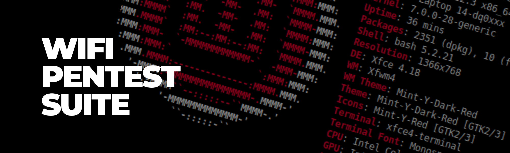

# 🔐 Auditoría de Seguridad WiFi: Captura de Handshake WPA2 con SSID Oculto y Ataque de Diccionario

## 🎯 Objetivo del Proyecto

Demostrar la vulnerabilidad de las redes WiFi WPA2 ante ataques de diccionario, utilizando un entorno controlado (red propia) para:

- ✅ Capturar un handshake WPA2 en una red con SSID oculto.
- ✅ Evaluar la robustez de la contraseña frente a herramientas de pentesting.
- ✅ Analizar la efectividad del ocultamiento del SSID como medida de seguridad.
- ✅ Documentar el proceso completo para fines educativos y de concienciación.

## 📁 Fase 1: Configuración del Hardware y Preparación del Entorno
- Selección del adaptador WiFi (RTL88x2bu)
- Instalación de drivers en Linux
- Activación del modo monitor
- Verificación del funcionamiento

## 📁 Fase 2: Captura y Análisis del Handshake WPA2
- Escaneo de redes
- Captura del handshake
- Resolución del problema del SSID oculto
- Ataque de diccionario con aircrack-ng
- Análisis de resultados y conclusiones

- ---
## 📚 Recursos y Herramientas

- **Aircrack-ng:** Suite para análisis de redes WiFi.
- **Wireshark:** Análisis de paquetes.
- **Adaptador WiFi USB AC1200 (RTL88x2bu):** Hardware compatible con modo monitor.
- **Diccionarios:** `master.list`, `rockyou.txt`.
---

### 📄 Documentación

📎 [Descargar Configuracion de Adaptador Wifi (.pdf)](./Configuracion-adaptadorwifi.pdf)

📎 [Descargar Auditoria (.pdf)](./auditoria.pdf)  

---

## 📌 Lecciones Aprendidas

- 🔒 El SSID oculto no es una medida de seguridad efectiva.
- 🧠 `aircrack-ng` siempre necesita el ESSID, incluso si se usa el BSSID.
- 📡 La captura en vivo es una técnica poderosa para obtener información que no está en una captura pasiva.
- 🔑 La fortaleza de la contraseña es el factor crítico en la seguridad de una red WiFi.

---

## 📬 Contacto

📧 [elarhuaa@gmail.com](mailto:elarhuaa@gmail.com)
